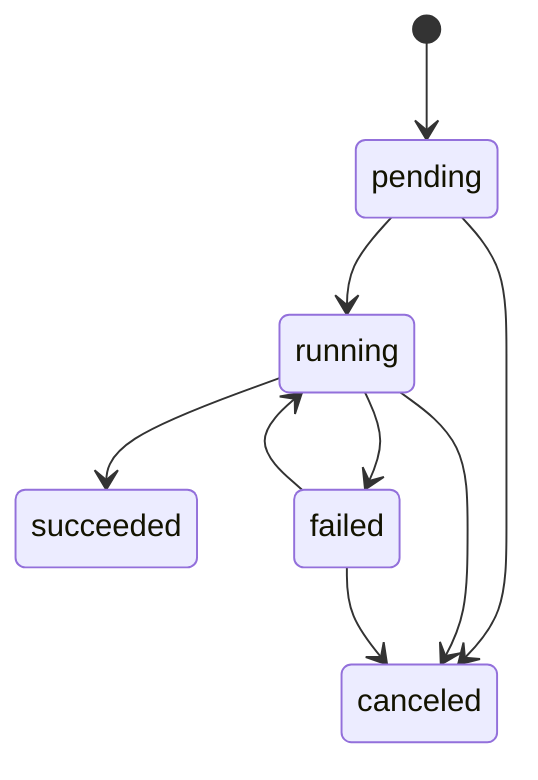
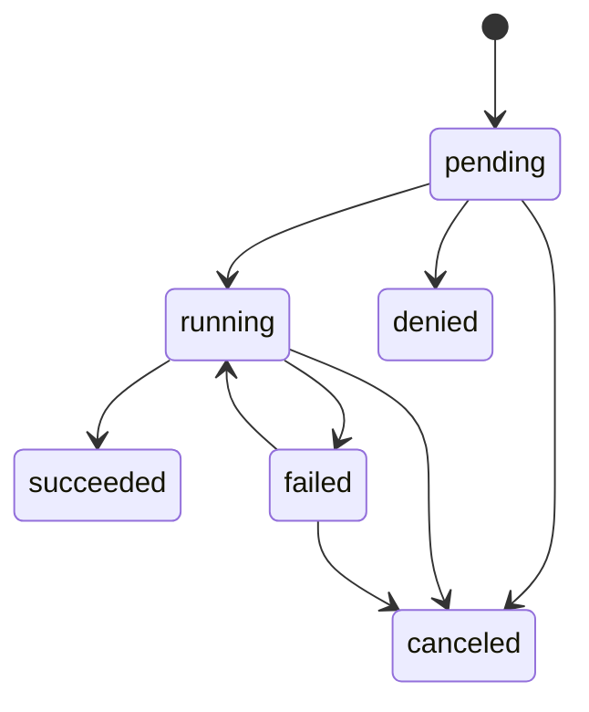

# Domain Models & Contracts

This document describes the current domain-layer contracts implemented under:

- `src/reflexor/domain/`

The domain layer is intended to remain pure (no framework/infrastructure imports) and
deterministic. Validation is primarily handled by Pydantic v2 models, with cross-entity
state rules centralized in `src/reflexor/domain/lifecycle.py`.

## Enums (Statuses)

Defined in `src/reflexor/domain/enums.py`.

| Enum | Values (stable strings) | Notes |
| --- | --- | --- |
| `TaskStatus` | `pending`, `running`, `succeeded`, `failed`, `canceled` | Task lifecycle state |
| `ToolCallStatus` | `pending`, `running`, `succeeded`, `failed`, `denied`, `canceled` | Tool execution lifecycle state |
| `ApprovalStatus` | `pending`, `approved`, `denied`, `expired`, `canceled` | `Approval` model currently restricts to `pending/approved/denied` |
| `RunStatus` | `created`, `running`, `succeeded`, `failed`, `canceled` | Run lifecycle state (used later) |

## Models

### `Event`

Implemented in `src/reflexor/domain/models_event.py` as `Event`.

Fields:

| Field | Type | Notes |
| --- | --- | --- |
| `event_id` | `str` | UUID4 string; generated by default |
| `type` | `str` | Trimmed; must be non-empty |
| `source` | `str` | Currently not normalized/validated beyond being a string |
| `received_at_ms` | `int` | Milliseconds since epoch (convention) |
| `payload` | `dict[str, object]` | Must be JSON-serializable; key/size caps enforced |
| `dedupe_key` | `str \| None` | Trimmed; empty becomes `None` |

Payload guardrails:

- Max key count: `DEFAULT_MAX_PAYLOAD_KEYS` (`src/reflexor/domain/models_event.py`)
- Max encoded JSON bytes: `DEFAULT_MAX_PAYLOAD_BYTES` (`src/reflexor/domain/models_event.py`)

### `ToolCall`

Implemented in `src/reflexor/domain/models.py` as `ToolCall`.

Fields:

| Field | Type | Notes |
| --- | --- | --- |
| `tool_call_id` | `str` | UUID4 string; generated by default |
| `tool_name` | `str` | Trimmed; must be non-empty |
| `args` | `dict[str, object]` | Must be JSON-serializable |
| `permission_scope` | `str` | Trimmed; must be non-empty |
| `idempotency_key` | `str` | Trimmed; must be non-empty |
| `status` | `ToolCallStatus` | Defaults to `pending` |
| `created_at_ms` | `int` | Generated by default (current time, ms) |
| `started_at_ms` | `int \| None` | Optional |
| `completed_at_ms` | `int \| None` | Optional |
| `result_ref` | `str \| None` | Trimmed; empty becomes `None` |

Model-level invariants (validated on every load):

- `started_at_ms >= created_at_ms` (when provided)
- `completed_at_ms >= created_at_ms` (when provided)
- `completed_at_ms >= started_at_ms` (when both provided)

Status-specific invariants are enforced by the lifecycle module (see below).

### `Task`

Implemented in `src/reflexor/domain/models.py` as `Task`.

Fields:

| Field | Type | Notes |
| --- | --- | --- |
| `task_id` | `str` | UUID4 string; generated by default |
| `run_id` | `str` | Required UUID4 string |
| `name` | `str` | Trimmed; must be non-empty |
| `status` | `TaskStatus` | Defaults to `pending` |
| `tool_call` | `ToolCall \| None` | Optional (but lifecycle requires it for `running/succeeded/failed`) |
| `attempts` | `int` | Defaults to `0`; must be `>= 0` |
| `max_attempts` | `int` | Defaults to `1`; must be `> 0` |
| `timeout_s` | `int` | Defaults to `60`; must be `> 0` |
| `depends_on` | `list[str]` | Each entry trimmed; must be non-empty |
| `created_at_ms` | `int` | Generated by default (current time, ms) |
| `started_at_ms` | `int \| None` | Optional |
| `completed_at_ms` | `int \| None` | Optional |
| `labels` | `list[str]` | Each entry trimmed; must be non-empty |
| `metadata` | `dict[str, object]` | Must be JSON-serializable |

Model-level invariants:

- `attempts <= max_attempts`
- `started_at_ms >= created_at_ms` (when provided)
- `completed_at_ms >= created_at_ms` (when provided)
- `completed_at_ms >= started_at_ms` (when both provided)

Status-specific invariants are enforced by the lifecycle module (see below).

### `Approval`

Implemented in `src/reflexor/domain/models.py` as `Approval`.

Fields:

| Field | Type | Notes |
| --- | --- | --- |
| `approval_id` | `str` | UUID4 string; generated by default |
| `run_id` | `str` | Required UUID4 string |
| `task_id` | `str` | Required UUID4 string |
| `tool_call_id` | `str` | Required UUID4 string |
| `status` | `ApprovalStatus` | Restricted to `pending/approved/denied` by validation |
| `created_at_ms` | `int` | Generated by default (current time, ms) |
| `decided_at_ms` | `int \| None` | Required when status is `approved`/`denied` |
| `decided_by` | `str \| None` | Trimmed; empty becomes `None` |
| `payload_hash` | `str \| None` | Trimmed; empty becomes `None` |
| `preview` | `str \| None` | Trimmed; empty becomes `None`; truncated to `DEFAULT_MAX_APPROVAL_PREVIEW_CHARS` |

Decision invariants:

- When `status == pending`: `decided_at_ms` and `decided_by` must be `None`
- When `status in {approved, denied}`: `decided_at_ms` is required
- `decided_at_ms >= created_at_ms` (when provided)

Helpers:

- `Approval.approve(...)` / `Approval.deny(...)` return a new validated `Approval`.
- These helpers default `decided_at_ms` to “now” (ms) if not provided.

### `RunPacket`

Implemented in `src/reflexor/domain/models_run_packet.py` as `RunPacket` (frozen/immutable-ish).

Fields:

| Field | Type | Notes |
| --- | --- | --- |
| `run_id` | `str` | Required UUID4 string |
| `parent_run_id` | `str \| None` | Optional UUID4 string |
| `event` | `Event` | Required |
| `reflex_decision` | `dict[str, object]` | JSON-serializable; per-field size cap |
| `plan` | `dict[str, object]` | JSON-serializable; per-field size cap |
| `tasks` | `list[Task]` | Max length `DEFAULT_MAX_TASKS`; all tasks must share `run_id` |
| `tool_results` | `list[dict[str, object]]` | JSON-serializable; per-entry size cap |
| `policy_decisions` | `list[dict[str, object]]` | JSON-serializable; per-entry size cap |
| `created_at_ms` | `int` | Generated by default (current time, ms) |
| `started_at_ms` | `int \| None` | Optional |
| `completed_at_ms` | `int \| None` | Optional |

Size caps exist to discourage embedding raw blobs; see constants in `src/reflexor/domain/models_run_packet.py`.

Helper methods (return new instances):

- `RunPacket.with_task_added(task)`
- `RunPacket.with_tool_result_added(tool_result)`
- `RunPacket.with_policy_decision_added(policy_decision)`

## Lifecycle & State Machines

Implemented in `src/reflexor/domain/lifecycle.py`.

The lifecycle module centralizes allowed status transitions and enforces status-specific
invariants. It is **pure and deterministic**:

- It does not call `time.time()` or generate UUIDs.
- It does not mutate models in place; transitions return new validated models.
- It does not auto-populate timestamps; callers must set `started_at_ms` / `completed_at_ms`
  as appropriate before calling `transition_*`.

### Allowed `TaskStatus` transitions

| From | To |
| --- | --- |
| `pending` | `running`, `canceled` |
| `running` | `succeeded`, `failed`, `canceled` |
| `failed` | `running`, `canceled` |
| `succeeded` | *(terminal)* |
| `canceled` | *(terminal)* |

Additional task transition behavior:

- Entering `running` from `pending` or `failed` increments `Task.attempts`.
- A retry (`failed → running`) is blocked once `attempts >= max_attempts`.
- Entering `running` clears `Task.completed_at_ms` (sets it to `None`).

Task invariants enforced by lifecycle (see `_validate_task_invariants`):

- `pending`: `started_at_ms` and `completed_at_ms` must be `None`
- `running`:
  - `tool_call` must exist and have `status == ToolCallStatus.RUNNING`
  - `started_at_ms` is required
  - `completed_at_ms` must be `None`
  - `attempts >= 1`
- `succeeded` / `failed`:
  - `tool_call` must exist
  - `tool_call.status` must match (`succeeded ↔ succeeded`, `failed ↔ failed`)
  - `started_at_ms` and `completed_at_ms` are required
  - `attempts >= 1`
- `canceled`:
  - `completed_at_ms` is required
  - if `tool_call` exists, it must be `canceled` or `denied`

### Allowed `ToolCallStatus` transitions

| From | To |
| --- | --- |
| `pending` | `running`, `denied`, `canceled` |
| `running` | `succeeded`, `failed`, `canceled` |
| `failed` | `running`, `canceled` |
| `succeeded` | *(terminal)* |
| `denied` | *(terminal)* |
| `canceled` | *(terminal)* |

Tool call invariants enforced by lifecycle (see `_validate_tool_call_invariants`):

- `pending`: `started_at_ms` and `completed_at_ms` must be `None`
- `running`: `started_at_ms` is required; `completed_at_ms` must be `None`
- `succeeded` / `failed`: `started_at_ms` and `completed_at_ms` are required
- `denied`: `started_at_ms` must be `None`; `completed_at_ms` is required
- `canceled`: `completed_at_ms` is required

## Canonical Serialization & Stable Hashing

Implemented in `src/reflexor/domain/serialization.py`.

### `canonical_json(obj) -> str`

Deterministic JSON encoding used for hashing:

- sorted keys
- stable separators (no insignificant whitespace)
- `ensure_ascii=False`

### `stable_sha256(*parts) -> str`

Computes a SHA-256 hex digest over multiple parts with length-delimiting, avoiding
ambiguities such as `["ab", "c"]` vs `["a", "bc"]`.

### `make_idempotency_key(tool_name, args, event_id) -> str`

Idempotency keys are computed as:

1. `tool_name.strip()`
2. `canonical_json(args)` (args must be JSON-serializable)
3. `event_id.strip()`
4. `stable_sha256(...)` over those three parts

Code: `src/reflexor/domain/serialization.py`.

